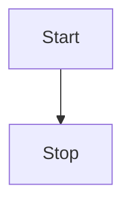

###### References


---
# Introduction

This is a scratchpad note. How does it show up in quartz?

When I tried building this the first time, I got an error. Quartz kept looking in my templates folder. Needed to expand the path to ignore. 

I just noticed that my default template to create daily notes - these start pages, did not include the current date. That is really weird. Perhaps I originally set that up before configuring the templator plugin?

Just updated the front matter created/modified values. Hopefully, this will make the posts easier to timestamp? 

Just installed the plugin "Emoji Autocomplete". Lets add a smiley face = 😄 . That looks nice. What about flags? 🇨🇦 Nice!

I'm curious to see how code snippets work with Quartz. Lets put in some python,

```python
print("Hello World")
for i in range(20):
    print("we are still counting")
```

And here is a mermaidJS diagram,


